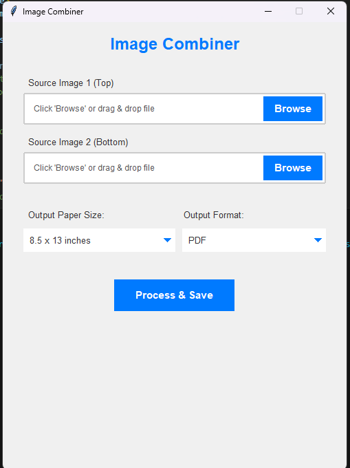

# Image Combiner

## Introduction

This application addresses a common issue faced by users of some Epson scanners (and potentially other scanners) that have limitations on scanning paper sizes, often capping at A4 height. This means scanning longer documents like legal-size or custom long bond paper in a single pass is not possible.

**Image Combiner** provides a solution by allowing users to scan a long document in two overlapping sections and then seamlessly merge these two image files into a single, continuous image. The application intelligently finds the best overlap between the two images to create a natural-looking join.

## Screenshot


## Features

*   **Graphical User Interface (GUI):** Easy-to-use interface built with Tkinter.
*   **Combine Two Images:** Merges a top image and a bottom image vertically.
*   **Smart Overlap Detection:** Automatically calculates the optimal overlap between the two images using Sum of Absolute Differences (SAD) to ensure a seamless merge.
*   **Padding for Consistent Width:** If the two source images have different widths, the narrower image is padded to match the width of the wider one before merging.
*   **Output Resizing:** Resizes the final merged image to fit standard paper sizes (e.g., 8.5 x 13 inches, 8.5 x 14 inches) at a specified DPI (default 300 DPI), maintaining aspect ratio by padding.
*   **Multiple Output Formats:** Save the combined image as PDF, PNG, or JPG.
*   **Drag and Drop:** Supports dragging and dropping image files directly into the input fields (if `tkinterdnd2` is installed).
*   **Asynchronous Processing:** Image processing is done in a separate thread to keep the UI responsive, with a loading indicator.
*   **User Notifications:** Provides feedback through toast messages and dialogs for success or error states.

## Libraries Used

The application primarily uses the following Python libraries:

*   **Tkinter:** For creating the graphical user interface.
    *   `tkinter.ttk` for themed widgets.
    *   `tkinter.filedialog` for open/save dialogs.
    *   `tkinter.messagebox` for alerts.
*   **Pillow (PIL Fork):** For image manipulation tasks such as:
    *   Opening, converting, and saving various image formats.
    *   Resizing, cropping, and pasting images.
    *   Converting images to NumPy arrays for processing.
*   **NumPy:** For efficient numerical operations, particularly in the image overlap detection algorithm (calculating Sum of Absolute Differences).
*   **os:** For path-related operations (checking if files exist).
*   **threading:** Used by `concurrent.futures.ThreadPoolExecutor` to run the image processing tasks in a background thread, preventing the GUI from freezing.
*   **ImageOps:** Used for image manipulation tasks.
*   **concurrent.futures:** Used for managing a pool of threads to run tasks asynchronously.
*   **tkinterdnd2 (Optional):** For adding drag-and-drop support for image files.

## How It Works

1.  **Input:** The user selects two image files: a "top" image and a "bottom" image. These are typically two scans of a long document, where the bottom of the first scan overlaps with the top of the second scan.
2.  **Overlap Detection (`find_best_overlap_height_optimized`):**
    *   The images are converted to NumPy arrays.
    *   The algorithm iterates through possible overlap heights (a proportion of the shorter image's height).
    *   For each potential overlap, it compares a strip from the bottom of the top image with a strip from the top of the bottom image.
    *   The Sum of Absolute Differences (SAD) is calculated for these strips. A lower SAD indicates a better match.
    *   The overlap height that yields the minimum normalized SAD is chosen as the best overlap. A threshold is used to ensure the match is significant.
3.  **Merging (`merge_images_vertically_optimized`):**
    *   If a valid overlap is found, the bottom image is cropped to remove the overlapping part that is already present in the top image.
    *   If the images have different widths, the narrower image is centered and padded with white to match the width of the wider image.
    *   A new blank image is created with the combined height (top image height + adjusted bottom image height) and the common (or padded) width.
    *   The top image is pasted at the top, and the adjusted bottom image is pasted directly below it.
4.  **Resizing (`resize_image_to_spec_optimized`):**
    *   The user selects a target paper size (e.g., "8.5 x 13 inches").
    *   The merged image is resized to fit within the target dimensions (calculated based on 300 DPI) while maintaining its aspect ratio.
    *   If the aspect ratio doesn't perfectly match, the image is centered and padded with white to fill the target dimensions.
5.  **Output:** The user is prompted to save the final processed image in their chosen format (PDF, PNG, or JPG).

## Installation and Usage Method 1

1.  **Running the Application:**
    *   Save the executable file from the release. Click the application to run.
    *   The application window will appear.
    *   Click "Browse" to select your top and bottom image files, or drag and drop them if `tkinterdnd2` is installed.
    *   Choose your desired "Output Paper Size" and "Output Format".
    *   Click "Process & Save".
    *   A save dialog will appear, allowing you to choose the location and name for your merged file.

## Installation and Usage Method 2

1.  **Prerequisites:**
    *   Python 3.x
    *   The following libraries need to be installed. You can install them using pip:
        ```bash
        pip install Pillow numpy
        ```
    *   For drag-and-drop functionality (optional):
        ```bash
        pip install tkinterdnd2
        ```
        If `tkinterdnd2` is not found, the application will still run but without drag-and-drop support, and a message will be printed to the console.

2.  **Running the Application:**
    *   Save the code as a Python file (e.g., `main.py`).
    *   Run the script from your terminal:
        ```bash
        python main.py
        ```
    *   The application window will appear.
    *   Click "Browse" to select your top and bottom image files, or drag and drop them if `tkinterdnd2` is installed.
    *   Choose your desired "Output Paper Size" and "Output Format".
    *   Click "Process & Save".
    *   A save dialog will appear, allowing you to choose the location and name for your merged file.

## Future Considerations / Potential Improvements

*   More sophisticated blending at the seam for an even smoother transition.
*   Option to manually adjust the detected overlap.
*   Support for more image formats.
*   Batch processing of multiple image pairs.
*   Preview of the merged image before saving.
